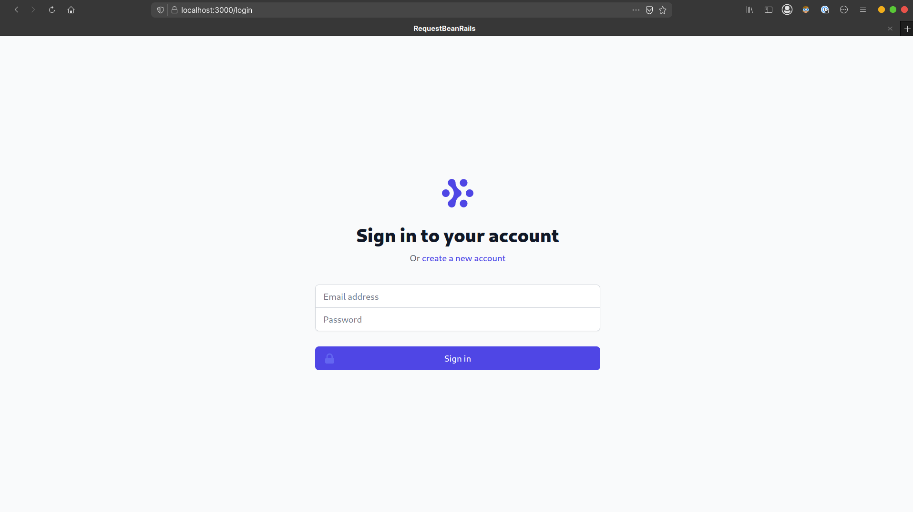
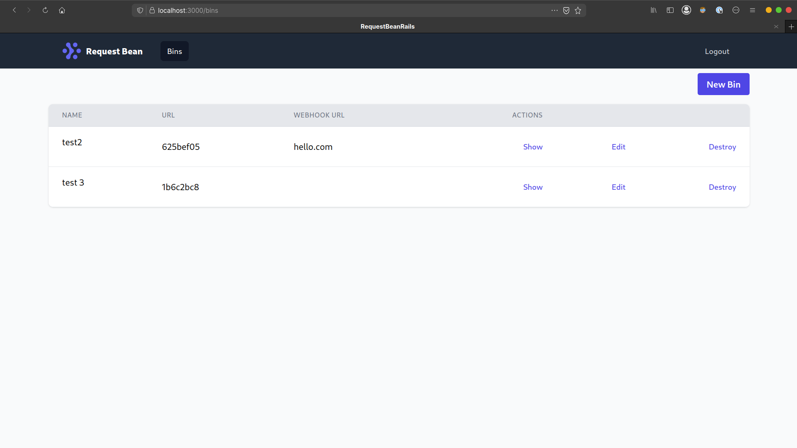
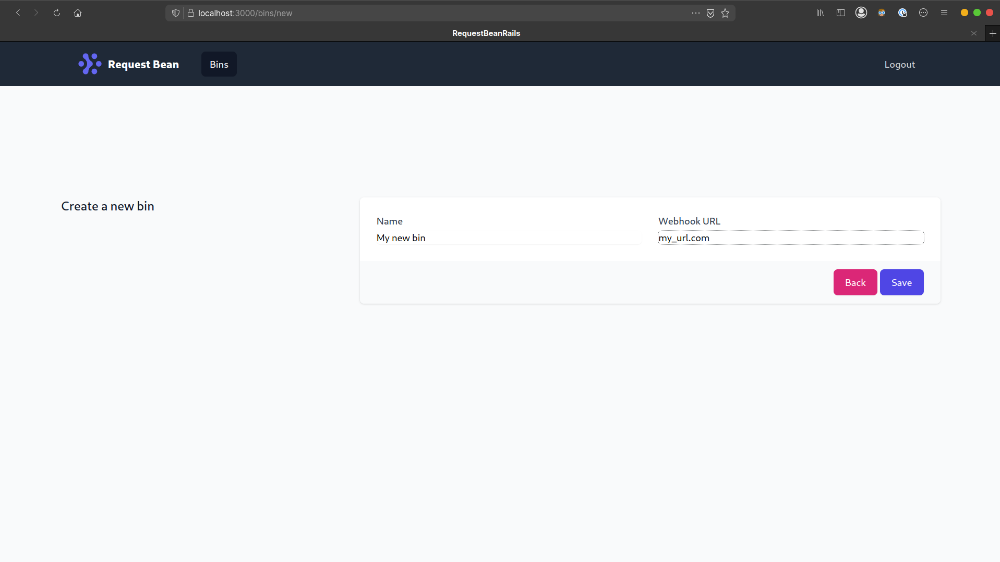
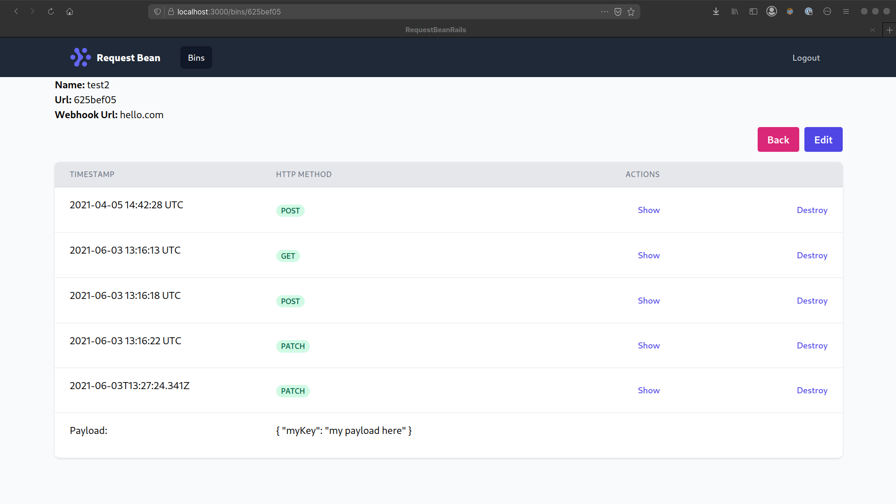
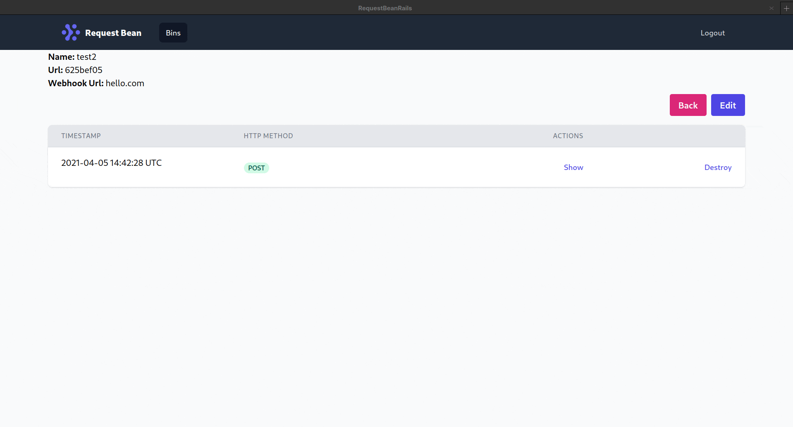

# Request Bean

Open source application that enables you to collect, parse, and view HTTP requests. Create your unique endpoints to inspect headers, body, query strings and cookies. It is built with [Ruby on Rails](https://rubyonrails.org/) in SSR mode, [Sidekiq](https://sidekiq.org/), [Action Cable](https://guides.rubyonrails.org/action_cable_overview.html), [Redis](https://redis.io/) [TailwindCSS](https://tailwindcss.com/) & [Webpack](https://webpack.js.org/).

# Installation

```sh
git clone https://github.com/awcrotwell/request-bean
cd request-bean

bundle install
npm i

rails s
```

# Features

## Authentication



Full authentication system allowing users to sign up, sign in, log out and delete their account. This functionality utilizes Rails' cookie jar. Once a user has been authenticated, a session cookie is set in their browser.

## Bins

Bins are records in the database belonging to users. A unique endpoint is autogenerated when creating a bin. This endpoint is where requests can be sent to for parsing and viewing. This endpoint accepts any HTTP method.



The dashboard page allows users to view their created bins.



Users can create new bins to separate requests as needed.

## Requests



Requests can be sent to bins enabling users to inspect headers, body, query strings and cookies.

## Websockets



Requests are streamed to the frontend via websockets. This is made using Rails' package Action Cable This allows users to send requests and view them without having to refresh the page.

## Webhooks


When creating a bin, users can optionally add a webhook url. When Request Bean recieves a request for this bin, a Sidekiq job will be set. When the job is executed, the payload of the request will be pulled from the database & forwarded to the provided URL.

